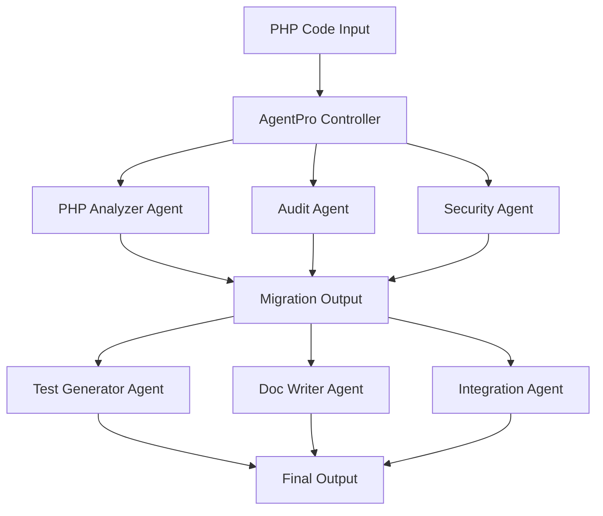

# AgentPro: Multi-Agent PHP to Next.js Migration Framework

<p align="center">
  
  
  
</p>

## 🎯 Project Overview

AgentPro is an innovative multi-agent system that automates the migration of PHP applications to Next.js, leveraging specialized AI agents for different aspects of the migration process. Each agent is powered by Mistral's Codestral model and focuses on specific tasks like code conversion, security analysis, and documentation generation.

### Key Features

- 🤖 **Multi-Agent Architecture**: Specialized agents working in harmony
- 🔄 **Automated Migration**: PHP to Next.js conversion with best practices
- 🔍 **Code Analysis**: Security audits and quality checks
- ✅ **Test Generation**: Automated test suite creation
- 📚 **Documentation**: Automatic README and documentation generation
- 🛠️ **Integration**: Seamless file structure creation and deployment

## 🏗️ Architecture



### Agent Specializations

1. **PHP Analyzer Agent**: Converts PHP code to Next.js
2. **Audit Agent**: Analyzes code structure and patterns
3. **Security Agent**: Identifies vulnerabilities
4. **Test Generator**: Creates unit tests
5. **Doc Writer**: Generates documentation
6. **Integration Agent**: Handles file organization and deployment

## 🚀 Quick Start

### Prerequisites

- Python 3.8+
- Node.js 16+
- MongoDB (for the migrated Next.js application)

### Installation

1. Clone the repository:
```bash
git clone https://github.com/your-username/AgentPro.git
cd AgentPro
```

2. Install Python dependencies:
```bash
pip install -r requirements.txt
```

3. Set up environment variables:
```bash
cp .env.example .env
# Edit .env with your API keys
```

### Usage

1. Start the migration interface:
```bash
streamlit run app.py
```

2. Upload your PHP project (ZIP or single file)
3. Click "Start Migration"
4. Monitor the progress through the UI
5. Download the migrated Next.js project

## 📋 Project Structure

```
agentpro/
├── agentpro/
│   ├── tools/
│   │   ├── php_migration_tool.py    # PHP to Next.js conversion
│   │   ├── php_audit_tool.py        # Code analysis
│   │   ├── security_tool.py         # Security checking
│   │   ├── test_generator_tool.py   # Test creation
│   │   └── ...
│   └── agent.py                     # Main agent controller
├── app.py                           # Streamlit interface
└── requirements.txt                 # Dependencies
```

## 🔧 Technical Approach

Our system uses a pipeline of specialized agents, each powered by Mistral's Codestral model, to handle different aspects of the migration process:

1. **Analysis Phase**
   - Code structure analysis
   - Security vulnerability scanning
   - Feature identification

2. **Migration Phase**
   - PHP to Next.js conversion
   - API route creation
   - Database integration

3. **Enhancement Phase**
   - Test suite generation
   - Documentation creation
   - File organization

4. **Output Phase**
   - Project structure creation
   - Environment setup
   - Deployment preparation

## 📝 License

This project is licensed under the Apache 2.0 License - see the LICENSE file for details.
